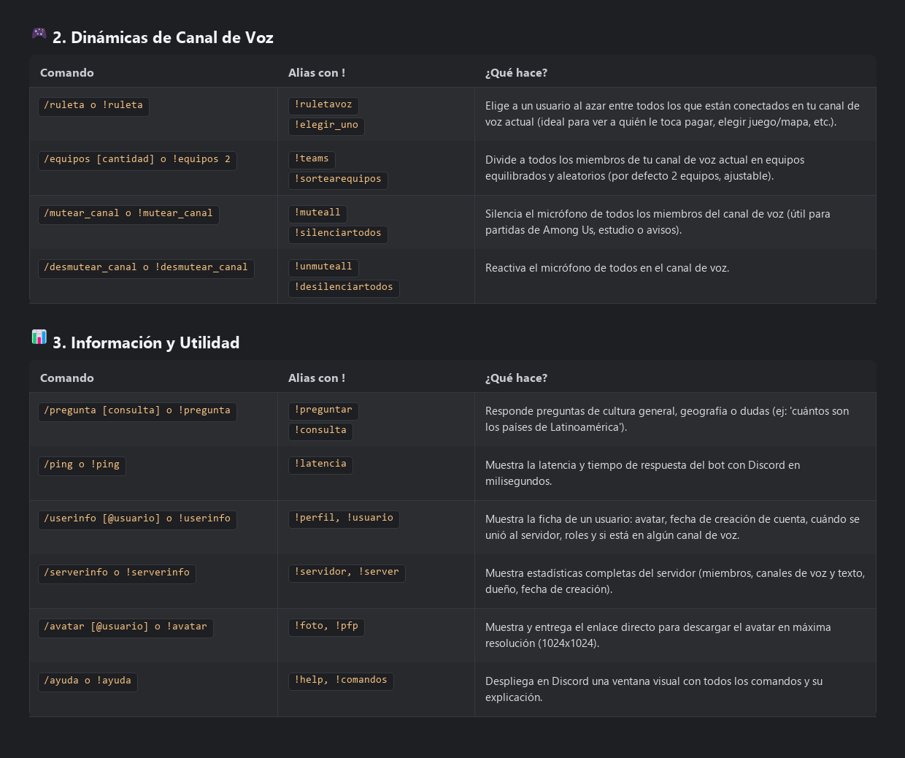

<div align="center">

# 🎙️ RadarVoiceBot • Discord MultiBot

**Bot multifuncional de Discord en Python con rastreador de voz en tiempo real, detector de usuarios "fantasma", asistente inteligente con Google Gemini AI + Búsqueda en Vivo, dinámicas de grupo y moderación.**

[](https://www.python.org/)
[](https://discordpy.readthedocs.io/)
[](https://aistudio.google.com/)
[](https://discloud.com/)
[](LICENSE)

[Características](#-características-principales) •
[Comandos](#-lista-de-comandos) •
[Instalación](#-instalación-y-puesta-en-marcha) •
[Despliegue 24/7](#-despliegue-247-en-la-nube-discloud) •
[Arquitectura](#-estructura-del-proyecto)

<br/>



</div>

---

## 🌟 Características Principales

### 🎙️ 1. Rastreador de Canales de Voz y Cazador de "Fantasmas"
* **Auto-detección Inteligente**: No necesitas especificar el nombre de la sala. Si estás conectado a un canal de audio, el bot sabe automáticamente en cuál estás.
* **Mención Directa (`<@usuario>`)**: Etiqueta a las personas que entraron o salieron para que puedas saber exactamente quién fue.
* **Cálculo de Permanencia**: Calcula al segundo cuánto tiempo permaneció cada miembro en la llamada.
* **Detector de Fantasmas / Ninjas**: Filtra específicamente a usuarios que entraron y salieron de inmediato (menos de 30 segundos) alertando la salida relámpago.
* **Alertas en Tiempo Real (Opcional)**: Permite configurar un canal de texto para recibir notificaciones automáticas cada vez que alguien entra o sale de voz.

### 🧠 2. Asistente con IA y Búsqueda en Vivo (Google Search Grounding)
* Conectado a **Google Gemini 2.0 Flash** con directivas anti-alucinación.
* **Búsqueda Web en Tiempo Real**: Si preguntas sobre noticias, resultados deportivos de hoy, cotizaciones o actualidad, la IA consulta Google en vivo y responde con datos verificados al minuto.
* **Modo Offline / Fallback**: Si no configuras una clave de IA, incluye respuestas nativas enriquecidas (ej: lista completa de los 20 países de América Latina) y búsqueda enciclopédica en Wikipedia en Español.

### 🎮 3. Dinámicas y Juegos de Voz
* **Ruleta de la Suerte**: Sortea al azar a uno de los miembros de tu canal de voz actual (ideal para ver quién paga las pizzas, quién juega o quién elige mapa).
* **Generador de Equipos**: Divide automáticamente a los conectados en equipos equilibrados al azar (2 a 10 equipos) para partidas de Valorant, CS2, LoL, etc.
* **Controles Rápidos de Voz**: Silencia o reactiva el micrófono de toda la sala con un solo comando (útil para Among Us o momentos de estudio).

### 🛡️ 4. Moderación y Utilidad Completa
* Limpieza masiva de mensajes (`/limpiar`).
* Expulsiones, baneos y aislamientos temporales (timeout).
* Estadísticas del servidor, información avanzada de usuarios, avatar en alta definición (1024px) y latencia en milisegundos.
* Juegos rápidos: Bola 8 mágica (`/8ball`), dados personalizables y cara o cruz.

---

## 📋 Lista de Comandos

Todos los comandos son **híbridos**: funcionan tanto con **Slash Commands (`/`)** como con el prefijo clásico (**`!`**).

### 🎙️ Rastreador de Voz
| Comando | Alias con `!` | Descripción |
| :--- | :--- | :--- |
| `/quien` | `!quien`, `!radar` | Detecta tu canal de voz actual, lista a los conectados y etiqueta a los que entraron o salieron recientemente con su tiempo de permanencia. |
| `/fantasma` | `!fantasma`, `!ninja` | Etiqueta únicamente a los usuarios que entraron y salieron de inmediato (menos de 30s). |
| `/historial_voz` | `!historial_voz` | Historial cronológico completo de entradas, salidas y cambios de canal. |
| `/set_canal_logs #canal` | `!setlogs` | *(Admin)* Configura un canal de texto para alertas automáticas en tiempo real. |
| `/toggle_logs_voz` | `!togglelogs` | *(Admin)* Activa o desactiva las alertas automáticas de voz. |
| `/limpiar_historial_voz` | `!resetvoz` | *(Admin)* Limpia la memoria de eventos de voz del servidor. |

### 🧠 Preguntas e Inteligencia Artificial
| Comando | Alias con `!` | Descripción |
| :--- | :--- | :--- |
| `/pregunta [consulta]` | `!pregunta`, `!consulta` | Responde cualquier duda de cultura general, geografía o actualidad con Google Gemini + Búsqueda en Vivo de Google. |

### 🎮 Dinámicas de Voz
| Comando | Alias con `!` | Descripción |
| :--- | :--- | :--- |
| `/ruleta` | `!ruleta` | Elige a un participante al azar entre los conectados a tu canal de voz. |
| `/equipos [cantidad]` | `!equipos` | Divide a los miembros de tu canal de voz en equipos equilibrados al azar. |
| `/mutear_canal` | `!muteall` | *(Admin)* Silencia a todos los miembros de tu canal de voz actual. |
| `/desmutear_canal` | `!unmuteall` | *(Admin)* Desilencia a todos los miembros del canal. |

### 📊 Utilidad & Moderación
| Comando | Alias con `!` | Descripción |
| :--- | :--- | :--- |
| `/ayuda` | `!ayuda` | Menú interactivo con todos los comandos y detalles del bot. |
| `/ping` | `!ping` | Latencia del bot y la API de Discord en ms. |
| `/userinfo [@usuario]` | `!userinfo` | Perfil detallado: fecha de cuenta, fecha de ingreso al server, roles y estado de voz. |
| `/serverinfo` | `!serverinfo` | Estadísticas del servidor (miembros, canales, dueño, creación). |
| `/avatar [@usuario]` | `!avatar` | Visualización y descarga del avatar en 1024x1024px. |
| `/limpiar [1-100]` | `!limpiar` | *(Admin)* Borra mensajes masivamente en un canal de texto. |
| `/expulsar [@usuario]` | `!expulsar` | *(Admin)* Expulsa a un miembro con razón. |
| `/banear [@usuario]` | `!banear` | *(Admin)* Banea a un usuario del servidor. |
| `/aislar [@usuario] [min]`| `!aislar` | *(Admin)* Aplica timeout temporal a un miembro. |

---

## 🚀 Instalación y Puesta en Marcha

### Prerrequisitos
* **Python 3.10 o superior**
* Una cuenta de Discord y acceso al [Discord Developer Portal](https://discord.com/developers/applications)

### 1. Clonar el Repositorio
```bash
git clone https://github.com/rapabru/radar-voice-bot.git
cd radar-voice-bot
```

### 2. Crear Entorno Virtual e Instalar Dependencias
```bash
# Crear entorno virtual
python -m venv .venv

# Activar en Windows
.venv\Scripts\activate

# Activar en Linux / macOS
source .venv/bin/activate

# Instalar librerías
pip install -r requirements.txt
```

### 3. Configurar Variables de Entorno (`.env`)
Crea un archivo llamado `.env` en la raíz (puedes basarte en `.env.example`):

```env
# Token secreto de tu bot de Discord
DISCORD_TOKEN=tu_token_aqui

# Prefijo para comandos de texto
COMMAND_PREFIX=!

# Umbral en segundos para detectar "fantasmas"
GHOST_THRESHOLD_SECONDS=30

# (Opcional) Clave de Google Gemini para IA con Búsqueda en Vivo
# Obtenla gratis en: https://aistudio.google.com
GEMINI_API_KEY=tu_api_key_de_gemini
```

### 4. Configurar el Bot en Discord Developer Portal
1. Entra a [Discord Developer Portal](https://discord.com/developers/applications) y crea una **New Application**.
2. Ve a la pestaña **Bot**:
   * Copia tu **Token**.
   * En **Privileged Gateway Intents**, activa:
     * ✅ **Presence Intent**
     * ✅ **Message Content Intent**
   * Guarda los cambios (**Save Changes**).
3. Ve a **OAuth2** -> **URL Generator**:
   * Scopes: `bot`, `applications.commands`
   * Permissions: `Administrator` (o permisos de voz, canales y mensajes).
   * Abre la URL generada en tu navegador e invita el bot a tu servidor.

### 5. Iniciar el Bot
* **En Windows**: Simplemente haz doble clic en `iniciar.bat` o ejecuta:
  ```powershell
  python main.py
  ```
* **En Linux / macOS**:
  ```bash
  python3 main.py
  ```

---

## ☁️ Despliegue 24/7 en la Nube (Discloud)

El proyecto viene con el archivo `discloud.config` preconfigurado para ejecutarse 24/7 gratis en [Discloud](https://discloud.com/):

```ini
NAME=RadarVoiceBot
TYPE=bot
MAIN=main.py
RAM=100
AUTORESTART=true
VERSION=latest
```

### Pasos para desplegar:
1. Empaqueta el bot ejecutando:
   ```bash
   python empaquetar.py
   ```
   *(Esto generará automáticamente el archivo limpio `bot.zip` sin incluir carpetas pesadas ni archivos innecesarios)*.
2. Inicia sesión con tu cuenta de Discord en [discloud.com/app](https://discloud.com/app).
3. Haz clic en **Add App** (o **Commit** si estás actualizando) y sube el archivo `bot.zip`.
4. Ve a la pestaña **`{ } Variáveis`** en Discloud y agrega:
   * `GEMINI_API_KEY` (tu clave de Google AI Studio).
5. Haz clic en **Reiniciar** y tu bot estará online las 24 horas sin depender de tu PC.

---

## 📁 Estructura del Proyecto

```text
radar-voice-bot/
├── cogs/
│   ├── voice_tracker.py    # Rastreador de voz, cálculo de tiempos y detector de fantasmas
│   ├── voice_tools.py      # Ruleta de participantes, sorteo de equipos y mute general
│   ├── utility.py          # Info de usuarios, servidor, avatares y ping
│   ├── moderation.py       # Limpieza de mensajes, expulsiones, baneos y timeouts
│   └── fun.py              # Bola 8 mágica, tirada de dados y monedas
├── .env.example            # Plantilla documentada de variables de entorno
├── .gitignore              # Protección estricta de credenciales y entornos locales
├── config.py               # Configuración centralizada de colores, prefijo y umbrales
├── discloud.config         # Configuración oficial para alojamiento en Discloud
├── empaquetar.py           # Script para generar bot.zip limpio para despliegue
├── generar_imagen.py       # Generador de infografía PNG de comandos
├── iniciar.bat             # Lanzador rápido de un clic para Windows
├── main.py                 # Punto de entrada, sincronización Slash y motor de IA
├── requirements.txt        # Dependencias de producción (discord.py, python-dotenv, etc.)
└── LICENSE                 # Licencia MIT
```

---

## 📄 Licencia

Este proyecto está bajo la Licencia **MIT** - consulta el archivo [LICENSE](LICENSE) para más detalles.

Desarrollado por [rapabru](https://github.com/rapabru).
